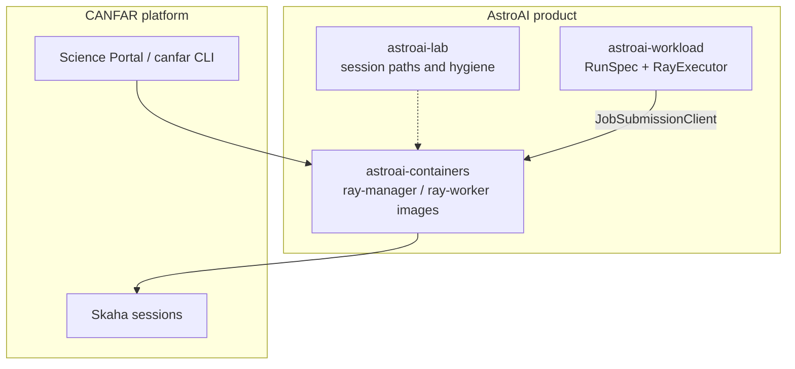
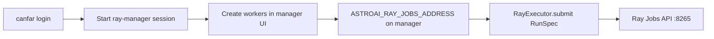

# astroai-workload

Python helpers to submit a command as a **Ray Job**, then poll status, fetch
logs, or cancel. Runs against the Jobs API on an AstroAI **ray-manager**
session on the [CANFAR Science Platform](https://www.opencadc.org/canfar/).



## Names at a glance

| Name | Meaning |
|------|---------|
| **AstroAI** | Product org and Harbor project `astroai` |
| **CANFAR** | Science Platform (portal, Skaha, `/arc`) |
| **`canfar`** | Platform CLI — login and session lifecycle |
| **`astroai-workload`** | This package — Jobs submit contract (`import astroai_workload`) |
| **ray-manager / ray-worker** | AstroAI images that host the Ray cluster |

Cluster create/stop and Dashboard wiring live in
[astroai-containers `docs/RAY.md`](https://github.com/astroai/astroai-containers/blob/main/docs/RAY.md).
This package speaks only to the Jobs API once the cluster is up.

## Install

On a ray-manager session, install into a project env (or scratch venv):

```bash
pip install "git+https://github.com/astroai/astroai-workload.git"
# or editable from a clone:
pip install -e /path/to/astroai-workload
```

Dependency: `ray[default]>=2.40`.

## Example

```python
from astroai_workload import RayExecutor, ResourceRequest, RunSpec

ex = RayExecutor()  # uses ASTROAI_RAY_JOBS_ADDRESS when set
job = ex.submit(
    RunSpec(
        run_id="mnist-001",
        command=("python", "train.py", "--epochs", "2"),
        resources=ResourceRequest(cpus=2, memory="4GiB"),
    )
)
print(ex.status(job))
print(ex.logs(job))
```

On a contributed **ray-manager** session, `startup-ray-manager.sh` sets
`ASTROAI_RAY_JOBS_ADDRESS=http://127.0.0.1:8265`, so `RayExecutor()` needs no
extra address. Open the stock Ray Dashboard in the browser at
`connectURL/dashboard/` (from `canfar ps`).



## Public API

| Symbol | Role |
|--------|------|
| `RunSpec` | One driver command, resources, optional env / working directory / provenance |
| `ResourceRequest` | `cpus`, `gpus`, `memory` (e.g. `"4GiB"`), walltime, custom resources |
| `RunStatus` | `pending` / `running` / `succeeded` / `failed` / `stopped` / `unknown` |
| `RayExecutor` | `submit` / `status` / `cancel` / `logs` via Ray Jobs |
| `resolve_jobs_address` | Explicit arg → `ASTROAI_RAY_JOBS_ADDRESS` → `RAY_DASHBOARD_URL` → `http://127.0.0.1:8265` |
| `DataProductRef`, `ProvenanceManifest` | Optional I/O and provenance records you attach to a `RunSpec` |
| `parse_memory` / `format_memory` | Size helpers |

`ResourceRequest` cpus/gpus map to Ray Job entrypoint resource args. The
`memory` field is recorded in job metadata for operators and tooling.

## On CANFAR (cluster first, then this package)

1. `canfar login` (once; credentials live under `/arc/home`)
2. Start a **contributed `ray-manager`** session (Science Portal or `canfar create`)
3. Prefer **≥8 GiB** memory on the manager when using the Dashboard / Jobs API
4. Open the connect URL → create workers → open **Dashboard**
5. On that manager session, install deps and run your submit script (or use Dashboard → Jobs)

Worked example: [examples/mnist_cnn/](examples/mnist_cnn/).

## Docs and related repos

| Link | Audience |
|------|----------|
| [examples/mnist_cnn/](examples/mnist_cnn/) | Newcomers — end-to-end train/infer via Jobs |
| [Ray on AstroAI](https://github.com/astroai/astroai-containers/blob/main/docs/RAY.md) | Cluster lifecycle (manager + workers) |
| [astroai-lab](https://github.com/astroai/astroai-lab) | Session paths, save/resume, hygiene |
| [CANFAR client](https://opencadc.github.io/canfar/) | Platform CLI |

## License

[MIT](LICENSES/MIT.txt)
