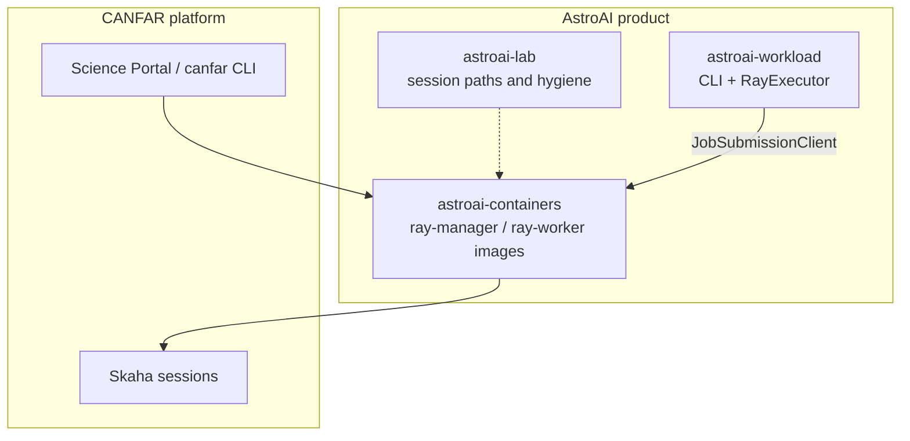
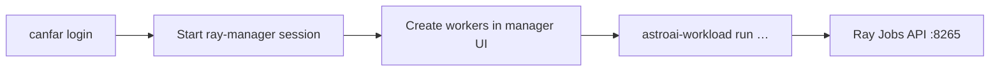

# astroai-workload

CLI + Python helpers to submit a command as a **Ray Job**, then poll status,
fetch logs, or cancel. Runs against the Jobs API on an AstroAI **ray-manager**
session on the [CANFAR Science Platform](https://www.opencadc.org/canfar/).


```mermaid
flowchart TB
  subgraph product [AstroAI product]
    Cont["astroai-containers<br/>ray-manager / ray-worker images"]
    Lab["astroai-lab<br/>session paths and hygiene"]
    WL["astroai-workload<br/>CLI + RayExecutor"]
  end
  subgraph platform [CANFAR platform]
    Portal[Science Portal / canfar CLI]
    Skaha[Skaha sessions]
  end
  Portal --> Cont
  Cont --> Skaha
  Lab -.-> Cont
  WL -->|"JobSubmissionClient"| Cont
```

## When to use what

| Goal | Tool |
|------|------|
| Scripted / repeatable Jobs from a shell | **`astroai-workload run` / `submit`** |
| Click-ops explore Jobs, actors, nodes | Ray Dashboard at `connectURL/dashboard/` |
| Interactive distributed Python | `ray.init(address="auto")` on the manager |
| Create / stop workers | Manager control panel at `/` |

Cluster create/stop and Dashboard wiring live in
[astroai-containers `docs/RAY.md`](https://github.com/astroai/astroai-containers/blob/main/docs/RAY.md).
This package speaks only to the Jobs API once the cluster is up.

## Day-one on ray-manager

Current `ray-manager` images ship `astroai-workload` on `PATH`. After workers
join:

```bash
astroai-workload run train.py --cpus 2 --memory 8GiB
astroai-workload status <run-id>
astroai-workload logs <run-id>
astroai-workload list
```

Or submit an arbitrary entrypoint:

```bash
astroai-workload submit --cmd 'python -m myscript --epochs 2' --cpus 2 --memory 8GiB --wait
```

`ASTROAI_RAY_JOBS_ADDRESS=http://127.0.0.1:8265` is set by
`startup-ray-manager.sh`, so no address guessing is required on the manager.


```mermaid
flowchart LR
  A["canfar login"] --> B["Start ray-manager session"]
  B --> C["Create workers in manager UI"]
  C --> D["astroai-workload run …"]
  D --> E["Ray Jobs API :8265"]
```

## Python API

```python
from astroai_workload import run_script, RunStatus

status, logs = run_script("train.py", cpus=2, memory="8GiB")
if status is not RunStatus.SUCCEEDED:
    print(logs)
```

Full control via `RunSpec` / `RayExecutor`:

```python
from astroai_workload import RayExecutor, ResourceRequest, RunSpec

ex = RayExecutor()
job = ex.submit(
    RunSpec(
        run_id="mnist-001",
        command=("python", "train.py", "--epochs", "2"),
        resources=ResourceRequest(cpus=2, memory="4GiB"),
    )
)
print(ex.status(job))
print(ex.logs(job))
```

`ResourceRequest.memory` is passed to Ray as `entrypoint_memory` (bytes), not
metadata-only.

## Install (outside the baked image)

```bash
pip install "git+https://github.com/astroai/astroai-workload.git"
# or editable:
pip install -e /path/to/astroai-workload
```

Dependency: `ray[default]>=2.40`, `typer>=0.12`.

## CLI reference

| Command | Role |
|---------|------|
| `run SCRIPT [args…]` | Submit a Python script and wait |
| `submit --cmd '…'` | Submit an arbitrary entrypoint |
| `status RUN_ID` | Show job status |
| `logs RUN_ID` | Print driver logs |
| `wait RUN_ID` | Block until terminal |
| `cancel RUN_ID` | Request stop |
| `list` | List jobs on the Jobs API |

Most commands accept `--address` and `--json`.

## Public API

| Symbol | Role |
|--------|------|
| `run_script` | One-liner: script → Job → `(status, logs)` |
| `RunSpec` | One driver command, resources, optional env / cwd / provenance |
| `ResourceRequest` | `cpus`, `gpus`, `memory` (e.g. `"4GiB"`), walltime, custom resources |
| `RunStatus` | `pending` / `running` / `succeeded` / `failed` / `stopped` / `unknown` |
| `RayExecutor` | `submit` / `status` / `cancel` / `logs` / `wait` / `list_jobs` |
| `resolve_jobs_address` | Explicit arg → `ASTROAI_RAY_JOBS_ADDRESS` → `RAY_DASHBOARD_URL` → localhost |
| `DataProductRef`, `ProvenanceManifest` | Optional I/O and provenance records on a `RunSpec` |

## Examples

| Example | Notes |
|---------|-------|
| [examples/smoke/](examples/smoke/) | No ML deps — first success check |
| [examples/mnist_cnn/](examples/mnist_cnn/) | Tiny CNN train/infer via Jobs |

## Docs and related repos

| Link | Audience |
|------|----------|
| [Ray on AstroAI](https://github.com/astroai/astroai-containers/blob/main/docs/RAY.md) | Cluster lifecycle (manager + workers) |
| [astroai-lab](https://github.com/astroai/astroai-lab) | Session paths, save/resume, hygiene |
| [CANFAR client](https://opencadc.github.io/canfar/) | Platform CLI |

## License

[MIT](LICENSES/MIT.txt)
