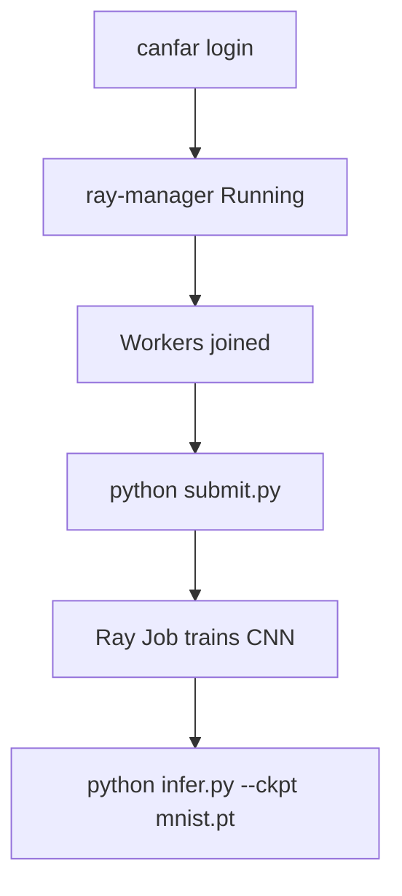

# MNIST CNN example

Train a tiny CNN with `astroai-workload` on an AstroAI **ray-manager** cluster
(CANFAR Science Platform).

## Prerequisites

Cluster lifecycle is documented in
[astroai-containers `docs/RAY.md`](https://github.com/astroai/astroai-containers/blob/main/docs/RAY.md).
Summary:

1. `canfar login`
2. Launch contributed `images.canfar.net/astroai/ray-manager:<tag>` (prefer **≥8 GiB**)
3. Open the session **connectURL** from `canfar ps`, create workers, open `connectURL/dashboard/`
4. Run the scripts below **on the ray-manager session** — Jobs uses
   `ASTROAI_RAY_JOBS_ADDRESS=http://127.0.0.1:8265`

Torch is installed for the job runtime (not a dependency of `astroai-workload`):

```bash
pip install torch torchvision
# or pin in a pixi/uv project and set RunSpec.working_directory accordingly
```



## Run

```bash
cd examples/mnist_cnn
python submit.py                 # RayExecutor → train.py
python infer.py --ckpt mnist.pt
```

You can also submit the same `train.py` entrypoint from Dashboard → Jobs.
